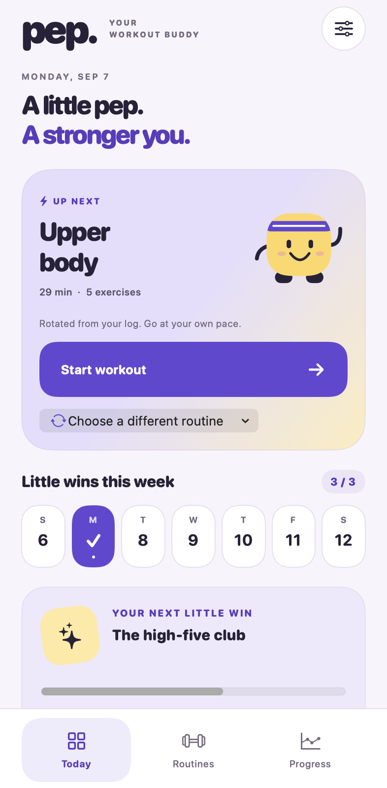
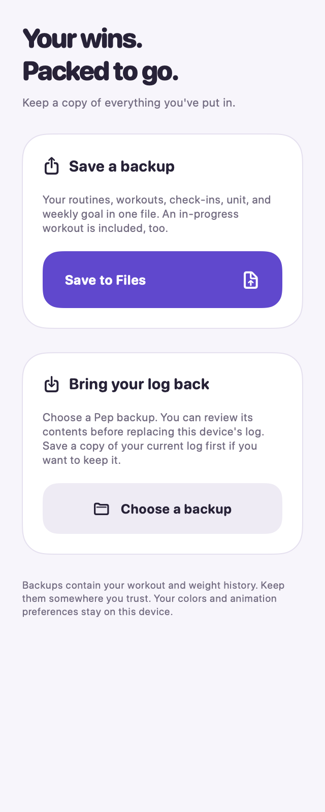

# Native layout previews

These images render the shared SwiftUI views in a macOS hosting window, using
fictional workout data. They help review layout and color changes; they are not
iPhone screenshots, Dynamic Type verification, or App Store assets. macOS control
styling differs from iOS.

The native `PepUITests` suite captures actual iPhone Simulator screenshots in the
`Pep-native-UI-results` GitHub Actions artifact. Review those for runtime behavior
and the largest text setting.

| Today | Backup and restore |
| --- | --- |
|  |  |
